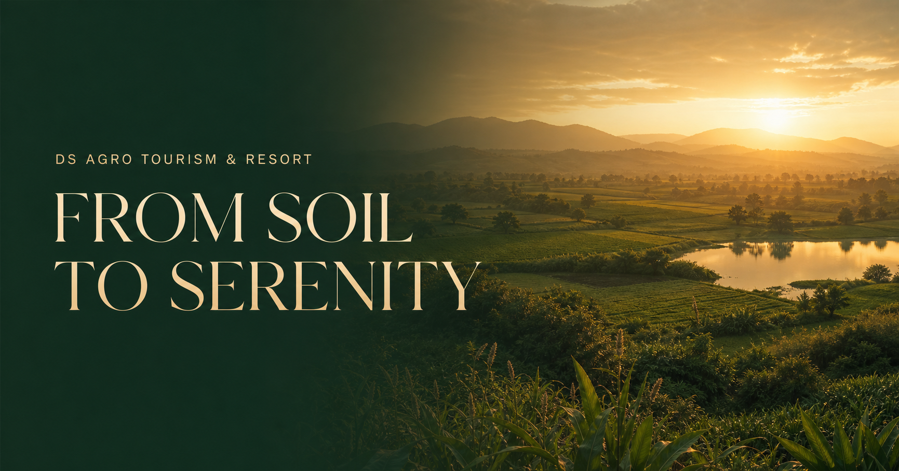

# DS Agro Tourism & Resort

  

   
   

  

 

A static-first hospitality website built around the “From Soil to Serenity” concept.

## Live website

Production is deployed only through GitHub Pages:

### [→ Open the live DS Agro Tourism website](https://satitech-official.github.io/DS-Agro-website/)

Every push to `main` runs the GitHub Actions deployment workflow. The app uses
GitHub Pages' repository sub-path for assets and internal navigation.

## Content updates

Verified contact information, navigation, experience cards and inner-page copy live in `data/site.ts`. Replace the inspiration photography with client-approved property images before a public marketing launch. Do not add prices, room categories, policies, capacities, timings or testimonials unless the resort has confirmed them.

## Enquiry flow

All booking calls-to-action create transparent, prefilled WhatsApp enquiries to the primary business number. The site never claims real-time availability or confirmed booking.

## Photography

Current images are remote experience-inspiration photographs from Unsplash and are explicitly disclosed as such. The official Instagram is linked as the source for current property-specific imagery.
